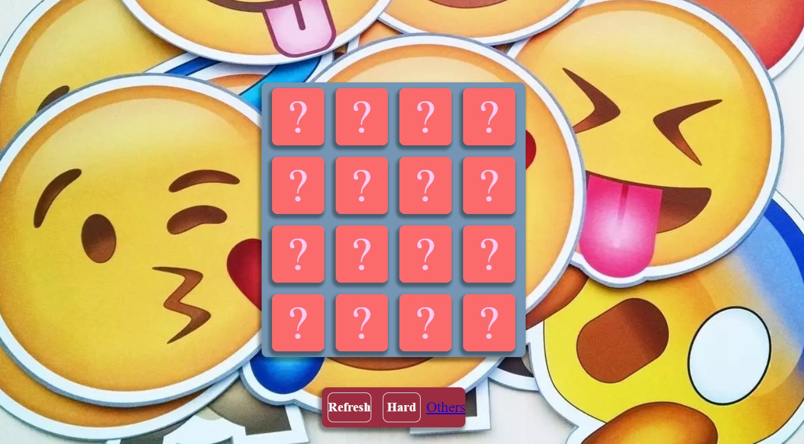
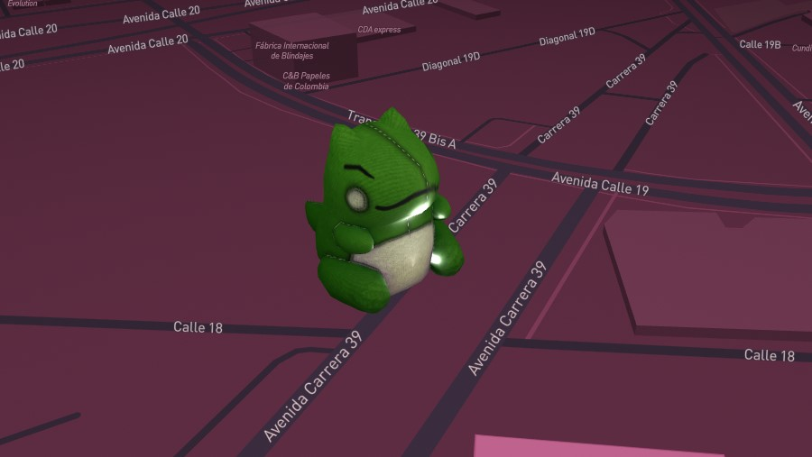

## Hi there 👋

# Tarjeta de Presentación

¡Hola! Soy Sampreciado07, y aquí hay algunos de mis proyectos destacados en GitHub:

---

    
    
    

---

**Modificacion de Plantilla:** *Esta es una de las páginas modificadas a partir de una plantilla ya creada*
**Link del Proyecto:** moficacionhtml.zeabur.app

**Juego de Memoria:** *Diseño de un juego de memoria con temática de varios emoticonos conocidos*
**Link del Proyecto:** https://sampreciado07.github.io/Memory-Game/

**Mapa con Modelo 3D:** *Adición de un modelo 3D de un personaje animado en un mapa*
**Link del Proyecto:** https://codepen.io/Sampreciado07/pen/RwmGMvj
<!--
**Sampreciado07/Sampreciado07** is a ✨ _special_ ✨ repository because its `README.md` (this file) appears on your GitHub profile.

Here are some ideas to get you started:

- 🔭 I’m currently working on ...
- 🌱 I’m currently learning ...
- 👯 I’m looking to collaborate on ...
- 🤔 I’m looking for help with ...
- 💬 Ask me about ...
- 📫 How to reach me: ...
- 😄 Pronouns: ...
- ⚡ Fun fact: ...
-->
