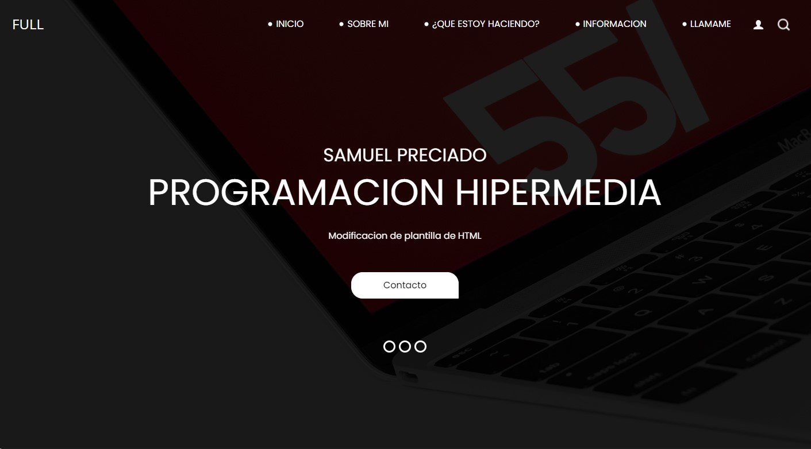
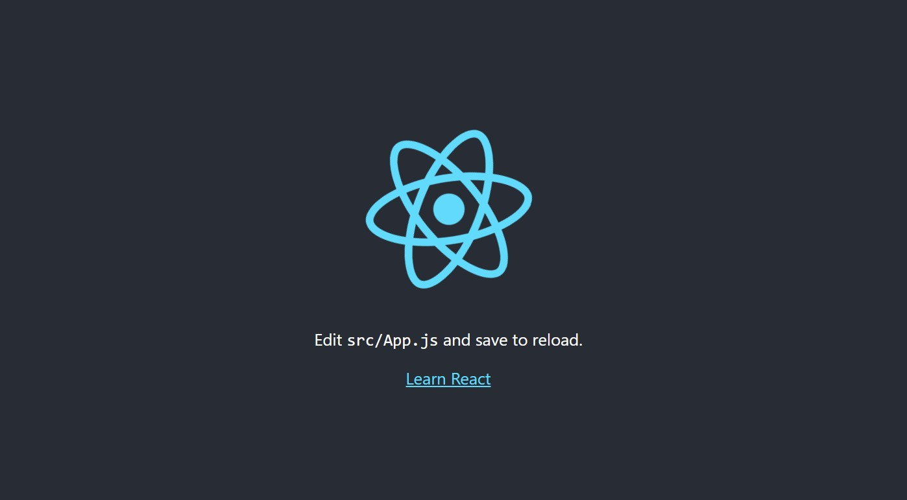

## Hi there 👋

# Tarjeta de Presentación

¡Hola! Soy [Tu Nombre], y aquí hay algunos de mis proyectos destacados en GitHub:

---

    
    
    

---

Proyecto 1: Descripción breve del proyecto.

Proyecto 2: Descripción breve del proyecto.

Proyecto 3: Descripción breve del proyecto.

<!--
**Sampreciado07/Sampreciado07** is a ✨ _special_ ✨ repository because its `README.md` (this file) appears on your GitHub profile.

Here are some ideas to get you started:

- 🔭 I’m currently working on ...
- 🌱 I’m currently learning ...
- 👯 I’m looking to collaborate on ...
- 🤔 I’m looking for help with ...
- 💬 Ask me about ...
- 📫 How to reach me: ...
- 😄 Pronouns: ...
- ⚡ Fun fact: ...
-->
